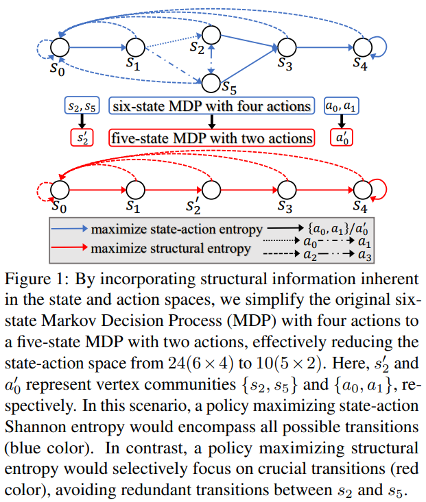

# Effective Exploration Based on the Structural Information Principles

## The Revised Manuscript

SI2E_ICML_2024.pdf

## Additional Supporting Materials

### Figure 1

### Figure 3

### Table 1

### Figure 4

### Table 2

### Glossary of Notations

### Tree Optimization

### SI2E Pseudocode

### Proof of Proposition 3.1

### Proof of Theorem 3.6

### Derivation of Structural Mutual Information

### Derivation about Upper Bound of Structural Mutual Information
